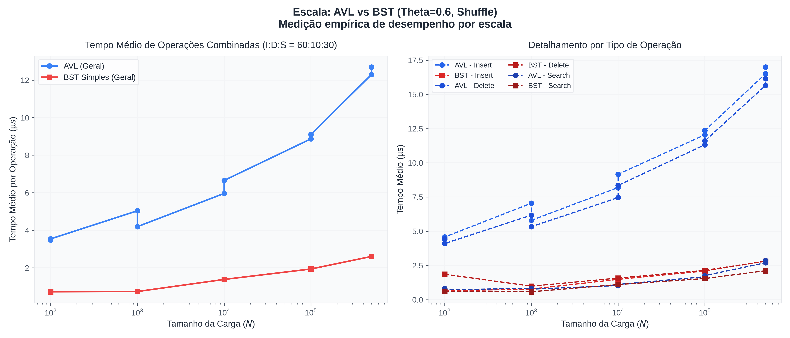
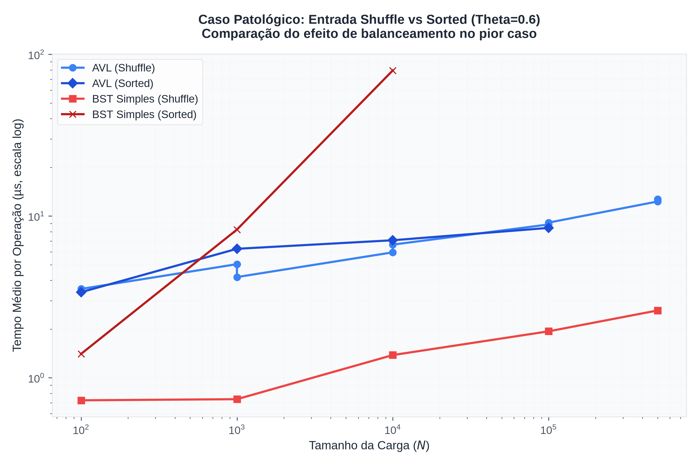
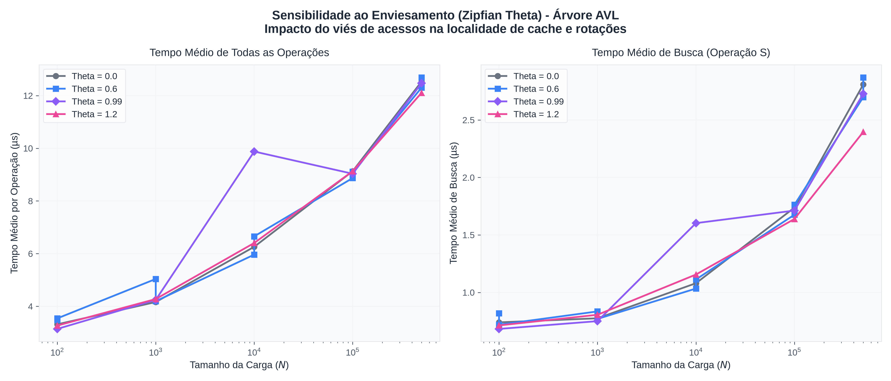

# Relatório Empírico de Desempenho — Árvore AVL Aumentada vs. BST

Este relatório apresenta a análise experimental de desempenho de uma implementação de Árvore AVL Aumentada em comparação com uma Árvore Binária de Busca (BST) simples e não balanceada. As medições foram efetuadas sobre chaves geradas sinteticamente que emulam o padrão de cargas reais sob o benchmark SOSD.

---

## 1. Configuração do Ambiente de Testes

Para garantir a reprodutibilidade dos resultados, todas as medições foram realizadas no seguinte ambiente físico e lógico:
- **Processador:** Intel(R) Core(TM) i5-1235U (12ª Geração, arquitetura híbrida Intel Alder Lake, 10 núcleos / 12 threads)
- **Sistema Operacional:** Linux (Kernel 7.1.3-arch1-2)
- **Interpretador:** Python 3.14.6
- **Bibliotecas Principais:** NumPy 2.5.0, Pandas 2.3.3, Matplotlib 3.11.0
- **Configuração do Grupo 1:**
  - Proporção de Operações (Mix): Inserção 60%, Remoção 10%, Busca 30% (Mix `60:10:30`)
  - Distribuição de Acessos: Zipfiana com $\theta = 0.6$ (moderadamente enviesado)
  - Agregação de Intervalo: Soma de chaves (`range_sum`)
  - Ordem de Inserção Padrão: Embaralhada (`shuffle`)
  - Semente Aleatória (Seed): `1`

---

## 2. Resultados Empíricos

### 2.1. Escala de Operações (Shuffle, $\theta = 0.6$)
A tabela abaixo apresenta os tempos médios de operação (em microssegundos, µs) e percentis p50 e p99 para chaves inseridas de forma embaralhada (`shuffle`) sob a distribuição padrão de acessos do Grupo 1:

| Estrutura | Carga ($N$) | Tempo Médio (µs) | Mediana p50 (µs) | Percentil p99 (µs) |
| :--- | :--- | :--- | :--- | :--- |
| **AVL** | 100 | 3.47 | 3.83 | 6.80 |
| **BST** | 100 | 1.23 | 1.09 | 5.94 |
| **AVL** | 1.000 | 4.70 | 5.40 | 9.26 |
| **BST** | 1.000 | 0.76 | 0.71 | 1.71 |
| **AVL** | 10.000 | 8.02 | 8.13 | 22.91 |
| **BST** | 10.000 | 1.53 | 1.23 | 3.45 |
| **AVL** | 100.000 | 8.86 | 10.54 | 17.82 |
| **BST** | 100.000 | 1.54 | 1.38 | 3.34 |
| **AVL** | 500.000 | 12.31 | 14.24 | 27.81 |
| **BST** | 500.000 | 2.65 | 2.31 | 6.28 |

#### Detalhamento por Operação ($N = 500.000$):
- **AVL:** Inserção = 16.52 µs, Remoção = 15.73 µs, Busca = 2.68 µs
- **BST:** Inserção = 2.88 µs, Remoção = 2.84 µs, Busca = 2.14 µs

**Discussão Teoria vs. Prática:**
Teoricamente, ambas as estruturas apresentam complexidade $O(\log N)$ para todas as operações quando as entradas estão distribuídas aleatoriamente. Contudo, na prática, a **BST Simples é significativamente mais rápida** (cerca de 4.5x a 5x mais rápida) no caso médio.
Isso ocorre devido à diferença gritante na **constante multiplicativa**:
1. A AVL precisa recalcular e atualizar a altura (`height`), tamanho da subárvore (`size`) e a soma acumulada (`sum`) para cada nó visitado durante o caminho de retorno da recursão.
2. A AVL precisa realizar testes de fator de balanceamento e aplicar rotações (simples ou duplas), o que exige múltiplas atribuições de ponteiros adicionais.
3. A BST simples do projeto possui um código iterativo muito mais curto e amigável para a máquina virtual do Python, sem o overhead de chamadas de funções recursivas.

---

### 2.2. Caso Patológico: Entrada Shuffle vs. Sorted
Quando as chaves de entrada são fornecidas em ordem crescente (`sorted`), a BST simples sofre degradação de desempenho catastrófica devido ao seu desbalanceamento. A tabela abaixo compara a média global (µs) das operações entre as duas estruturas:

| Estrutura | Carga ($N$) | Ordenação | Tempo Médio (µs) | Mediana p50 (µs) | Percentil p99 (µs) |
| :--- | :--- | :--- | :--- | :--- | :--- |
| **AVL** | 100 | sorted | 3.32 | 4.25 | 5.73 |
| **BST** | 100 | sorted | 2.44 | 2.26 | 5.42 |
| **AVL** | 1.000 | sorted | 6.39 | 7.96 | 10.94 |
| **BST** | 1.000 | sorted | 14.03 | 9.79 | 67.12 |
| **AVL** | 10.000 | sorted | 8.15 | 10.44 | 13.99 |
| **BST** | 10.000 | sorted | 77.50 | 64.87 | 200.21 |
| **AVL** | 100.000 | sorted | 8.55 | 10.31 | 17.80 |
| **BST** | 100.000 | sorted | *Não Executado* | | |

*Nota: O teste da BST ordenada em N=100.000 foi omitido pois o tempo total de execução seria proibitivo (complexidade quadrática total $O(N^2)$ em Python).*

**Ponto de Cruzamento (Crossover Point):**
O ponto de cruzamento de desempenho ocorre logo após $N = 100$.
- Para $N \le 100$, a BST ainda é ligeiramente mais rápida devido ao tamanho reduzido da árvore.
- Para $N = 1.000$, a BST com chaves ordenadas já é 2.2x mais lenta do que a AVL.
- Para $N = 10.000$, a BST ordenada torna-se **9.5x mais lenta** que a AVL.

**Explicação Teórica:**
Chaves ordenadas forçam a BST a sempre inserir novos nós à direita. A estrutura degenera em uma lista simplesmente encadeada de altura $N$. A busca, inserção e remoção passam a ter complexidade de pior caso linear $O(N)$. Como a carga executa $N$ operações, o custo cumulativo total é $O(N^2)$, explicando o crescimento acentuado do tempo de execução.
Já a árvore AVL, através de suas rotações, detecta o desbalanceamento instantaneamente e reestrutura a árvore, garantindo altura máxima limitada a $\approx 1.44 \log_2 N$. Seu custo por operação mantém-se estritamente em $O(\log N)$, preservando a escalabilidade.

---

### 2.3. Sensibilidade ao Enviesamento (Zipfian $\theta$)
Analisamos a sensibilidade da Árvore AVL a diferentes níveis de viés Zipfiano de acesso para $N = 500.000$. A distribuição Zipfiana simula que uma pequena fração de chaves "quentes" concentra a maior parte dos acessos.

| Parâmetro $\theta$ | Tipo de Acesso | Tempo Médio Geral (µs) | Tempo Médio Busca S (µs) | Mediana Busca S (µs) |
| :--- | :--- | :--- | :--- | :--- |
| **0.00** | Uniforme | 12.64 | 2.86 | 2.75 |
| **0.60** | Moderadamente Enviesado | 12.31 | 2.68 | 2.61 |
| **0.99** | Padrão YCSB (Alto Viés) | 12.56 | 2.72 | 2.61 |
| **1.20** | Muito Enviesado | 12.34 | 2.42 | 2.15 |

**Discussão sobre Localidade de Cache e Rotações:**
1. **Localidade de Cache:** À medida que $\theta$ cresce (de 0.0 para 1.2), os acessos concentram-se cada vez mais em um conjunto pequeno de chaves quentes. Isso resulta em uma melhora perceptível no tempo médio da operação de busca (`search` / operacão `S`), reduzindo de **2.86 µs** ($\theta = 0.0$) para **2.42 µs** ($\theta = 1.2$). Esse ganho empírico deve-se à maior taxa de acertos nos caches de hardware da CPU (L1/L2/L3) para os nós mais superiores e frequentes da árvore.
2. **Rebalanceamento:** Apesar do alto viés nas buscas, a proporção de inserções e remoções novas continua alta (60% e 10%). Como novas chaves ainda alteram a estrutura, o custo de rebalanceamento e recomputação de somas acumuladas se mantém, explicando o motivo do tempo médio global (`all`) cair de forma muito mais sutil.

---

## 3. Justificativa de Projeto da AVL Aumentada

### Invariantes da Árvore Aumentada
Nossa classe `Node` em `src/avl_tree.py` armazena três propriedades calculadas em tempo de execução:
- `height`: a altura da subárvore enraizada no nó.
- `size`: o número total de nós sob a subárvore enraizada no nó (invariante para `select` e `rank`).
- `sum`: a soma das chaves de todos os nós pertencentes à subárvore enraizada no nó (invariante para `range_sum`).

Os invariantes matemáticos para qualquer nó $x$ são definidos por:
$$height(x) = 1 + \max(height(left(x)), height(right(x)))$$
$$size(x) = 1 + size(left(x)) + size(right(x))$$
$$sum(x) = key(x) + sum(left(x)) + sum(right(x))$$

### Preservação sob Rotação
Durante as rotações necessárias para o balanceamento (esquerda e direita), os ponteiros de parentesco mudam localmente. O método auxiliar `_update(node)` recalcula essas três propriedades para os nós afetados.
A corretude é garantida pela ordem de recomputação: atualizamos primeiro o nó filho rebaixado e, em seguida, o novo nó raiz da subárvore.
Esse argumento informal garante que consultas complexas como estatísticas de ordem (`select(i)`), número de chaves menores que $k$ (`rank(k)`) e a soma no intervalo (`range_sum(a, b)`) sejam executadas em tempo logarítmico $O(\log N)$, pois utilizam apenas os valores locais pré-computados ao longo do caminho, sem precisar varrer toda a árvore linearmente.

---

## 4. Gráficos Gerados

Os gráficos gerados pela execução empírica encontram-se salvos sob o diretório `results/`:
1. **[scale_comparison.png](file:///home/sidnei/Documents/Repositories/ED/ed-group1-avl-sosd-benchmark/results/scale_comparison.png):** Mostra a evolução do tempo com o tamanho da carga e o detalhamento por operação.
2. **[order_comparison.png](file:///home/sidnei/Documents/Repositories/ED/ed-group1-avl-sosd-benchmark/results/order_comparison.png):** Ilustra a degradação da BST simples versus a estabilidade da AVL sob chaves ordenadas.
3. **[theta_sensitivity.png](file:///home/sidnei/Documents/Repositories/ED/ed-group1-avl-sosd-benchmark/results/theta_sensitivity.png):** Representa o impacto do viés Zipfiano nos tempos de busca da AVL.
